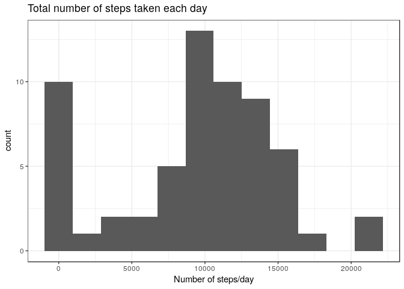
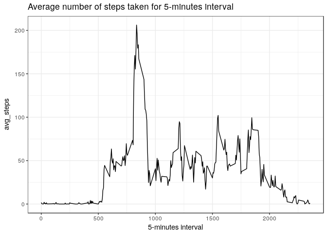
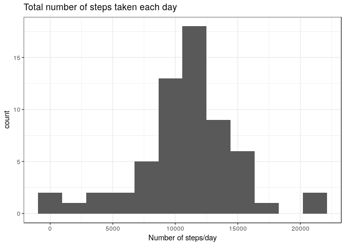
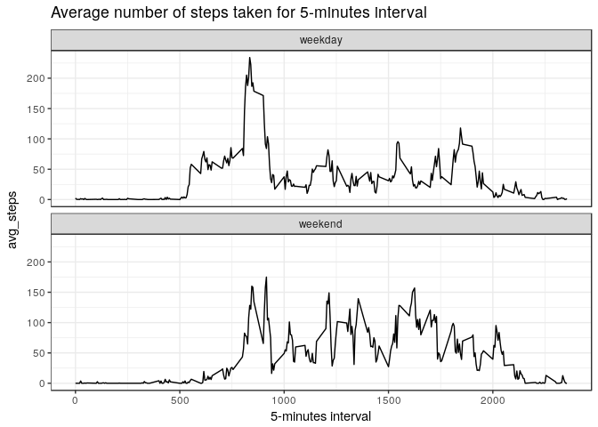

```r
library(tidyverse)
library(knitr)
library(lubridate)
theme_set(theme_bw())
```


## Loading and preprocessing the data


```r
dat <- read_csv("data/activity.csv")
summary(dat)
```

```
##      steps             date               interval     
##  Min.   :  0.00   Min.   :2012-10-01   Min.   :   0.0  
##  1st Qu.:  0.00   1st Qu.:2012-10-16   1st Qu.: 588.8  
##  Median :  0.00   Median :2012-10-31   Median :1177.5  
##  Mean   : 37.38   Mean   :2012-10-31   Mean   :1177.5  
##  3rd Qu.: 12.00   3rd Qu.:2012-11-15   3rd Qu.:1766.2  
##  Max.   :806.00   Max.   :2012-11-30   Max.   :2355.0  
##  NA's   :2304
```

## What is mean total number of steps taken per day?

The histogram of the total number of steps taken each day.

<!-- -->


In addition, the mean and median of the total number of steps taken per day are 9354.2295082 and 10395 respectively.

## What is the average daily activity pattern?

The plot is shown below

<!-- -->

Which 5-minute interval, on average across all the days in the dataset, contains the maximum number of steps?


The 5-minute interval is 835.


## Imputing missing values


```r
# 1 
missing <- sum(is.na(dat$steps))

# 
```

1. Calculate and report the total number of missing values in the dataset (i.e. the total number of rows with 𝙽𝙰s)

> Total number of missing values is 2304.

2. Devise a strategy for filling in all of the missing values in the dataset. The strategy does not need to be sophisticated. For example, you could use the mean/median for that day, or the mean for that 5-minute interval, etc.

3. Create a new dataset that is equal to the original dataset but with the missing data filled in.

> I will fill in the missing values with the mean for that 5-minute interval.


```r
impute <- dat %>% group_by(interval) %>% 
        summarise(avg_steps = mean(steps, na.rm = TRUE))

dat_imputed <- dat %>% left_join(impute) %>% 
        mutate(steps = as.numeric(steps),
               steps = if_else(is.na(steps), avg_steps, steps))

head(dat_imputed)
```

```
## # A tibble: 6 x 4
##    steps date       interval avg_steps
##    <dbl> <date>        <int>     <dbl>
## 1 1.72   2012-10-01        0    1.72  
## 2 0.340  2012-10-01        5    0.340 
## 3 0.132  2012-10-01       10    0.132 
## 4 0.151  2012-10-01       15    0.151 
## 5 0.0755 2012-10-01       20    0.0755
## 6 2.09   2012-10-01       25    2.09
```


4. Make a histogram of the total number of steps taken each day and Calculate and report the mean and median total number of steps taken per day. Do these values differ from the estimates from the first part of the assignment? What is the impact of imputing missing data on the estimates of the total daily number of steps?

> After inputation, the histogram of the total number of steps taken each day.

<!-- -->


After imputation, the mean and median of the total number of steps taken per day are 10766 and 10766 respectively.

After imputing the missing data, the mean and meidian become equal to each other and are larger than without imputing missing value.


## Are there differences in activity patterns between weekdays and weekends?

1. Create a new factor variable in the dataset with two levels – “weekday” and “weekend” indicating whether a given date is a weekday or weekend day.


```r
dat_fct <- dat %>% mutate(
        tmp = if_else(weekdays(dat$date) %in% c("Saturday", "Sunday"),
                      "weekend", "weekday")) %>% mutate(fct_week = as.factor(tmp))
               
dat_fct %>% head()
```

```
## # A tibble: 6 x 5
##   steps date       interval tmp     fct_week
##   <int> <date>        <int> <chr>   <fct>   
## 1    NA 2012-10-01        0 weekday weekday 
## 2    NA 2012-10-01        5 weekday weekday 
## 3    NA 2012-10-01       10 weekday weekday 
## 4    NA 2012-10-01       15 weekday weekday 
## 5    NA 2012-10-01       20 weekday weekday 
## 6    NA 2012-10-01       25 weekday weekday
```


2. Make a panel plot containing a time series plot (i.e. 𝚝𝚢𝚙𝚎 = "𝚕") of the 5-minute interval (x-axis) and the average number of steps taken, averaged across all weekday days or weekend days (y-axis). See the README file in the GitHub repository to see an example of what this plot should look like using simulated data.

> The plot is as below.

<!-- -->

